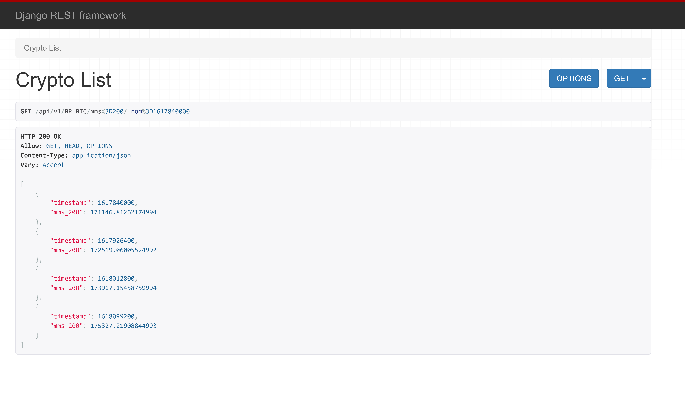
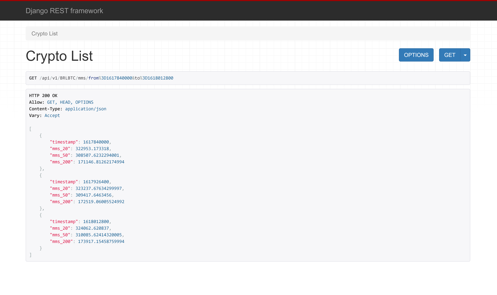
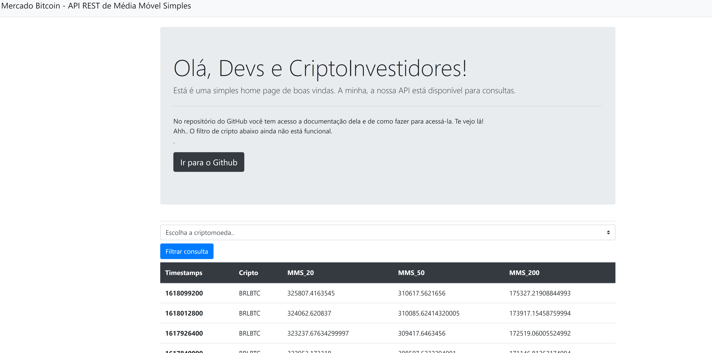
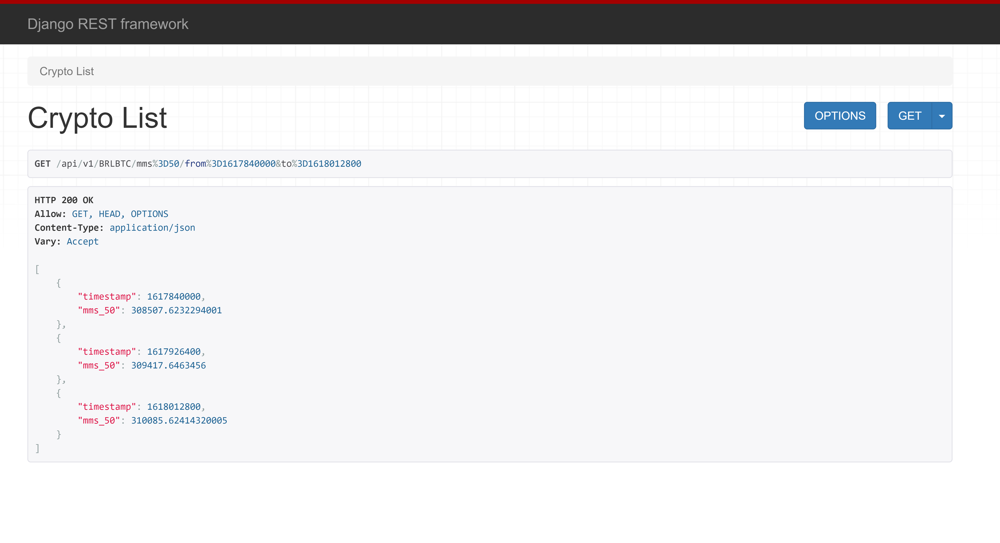

MMS Pair - MB Challenge
======

MMS Pair is a project developed following the scope of the challenge of the Mercado Bitcoin, a Brazilian company.
------


### Challenge
Create a service that delivers variations of simple moving averages (Média Móvel Simples in portuguese, because of that I use MMS in the code), 20, 50 and 200 days, of the Bitcoin and Etherium currencies that are listed on the Bitcoin Market.

**Challenge requirements - Summarized**

1. Expose an HTTP route where GET /:pair/mms returns the variation of the MMS given a start and end period.
2. Create a script that makes the initial loading of the table, calculating the MMS of 20, 50 and 200, of the last 365 days, of each pair (BRLBTC, BRLETH).
3. Write a Job and include in the documentation the strategy for daily increment of the
table.
4. Consider that the candles API may be unavailable, so in this scenario the process of increasing the day must be resilient to the point of concluding what needs to be done when the API becomes available again.
5. Elaborate a monitoring strategy where in case there is no record of any day among the records of the last 365 days, an alarm of any kind should be triggered.

------
## Technologies

* The project was developed using the framework [Django](https://www.djangoproject.com/) with [Python 3](https://www.python.org/).
* For create the Web API was used [Django REST framework](https://www.django-rest-framework.org/) a powerful and flexible toolkit for use in API.
* To create and schedule jobs, [Django-cron](https://django-cron.readthedocs.io/en/latest/installation.html) was applied to the project.
* HTML was used to create the layouts templates.
* CSS and [Bootstrap](https://getbootstrap.com/) were used for the basic styling of the navbar, table, forms, and other components.
* Finally, [Heroku](www.heroku.com) was used to deploy the project.

## Screenshots

- Desktop Screenshot  
  

- Mobile Screenshot  
  


## Development 

```shell
# 1. Make the project directory
mkdir /project_directory

# 1.1. Go to the project directory
cd /project_directory

# 2. Create the virtual environment inside the directory
python -m venv /project_directory

# 2.1. Activate it
source /project_directory/venv/bin/activate

# 3. Clone the project on project directory
git clone https://github.com/mvr-garcia/mb_challenge.git

# 4. Install the project dependencies
pip install -r requirements.txt

# 5. Make database migrations
python manage.py makemigrations
python manage.py migrate

# 6. Run django-admin command for populate/update Database
python manage.py checkdb

# 7. Run django-admin commando for schedule jobs
python manage.py runcrons

# 8. Run the server
python manage.py runserver
```

## Live Demo

The project is live on Heroku, to visit click on [here](https://mms-pair.herokuapp.com/).

## API Documentation

- The MMS API return the movin average in a given period for a given crypto.
- Only GET request are 

### #1 Endpoint
The main API endpoint require 4 parameters:

* Crypto: 'BRLBTC' or 'BRLETH'
* MMS: 20, 50 ou 200
* Start timestamp // timestamps < 365 are not accepted
* Final timestamp

URL: .../api/v1/[crypto]/mms=[mms_period]/from=[start_timestamp]&to=[final_timestamp]

Request example:
```
http://127.0.0.1:8000/api/v1/BRLBTC/mms=50/from=1617840000&to=1618012800
```
Result:



### #2 Endpoint
The second API endpoint require 3 parameters:

* Crypto: 'BRLBTC' or 'BRLETH'
* MMS: 20, 50 ou 200
* Start timestamp // timestamps < 365 are not accepted
Obs: Final timestamp is not mandatory, in which case it considers the last day.

URL: .../api/v1/[crypto]/mms=[mms_period]/from=[start_timestamp]&to=[final_timestamp]

Request example:
```
http://127.0.0.1:8000/api/v1/BRLBTC/mms=50/from=1617840000
```
Result:


### #3 Endpoint
The third API endpoint require 3 parameters:

* Crypto: 'BRLBTC' or 'BRLETH'
* ~~MMS: 20, 50 ou 200~~ // API will return all 3 mms
* Start timestamp // timestamps < 365 are not accepted
* Final timestamp // now is mandatory

URL: .../api/v1/[crypto]/mms/from=[start_timestamp]

Request example:
```
http://127.0.0.1:8000/api/v1/BRLBTC/mms/from=1617840000&to=1618012800
```


## License

[](https://opensource.org/licenses/MIT)

## Authors
Marcos Garcia   
e-mail: mvrgarcia05@gmail.com
